### 팀 소개 및 팀원 자기소개

- YBIGTA 2조
  - 김지호: 연세대학교 도시공학과 20학번
    - Solved.ac Ruby V
    - SWM 16기
    - 알고리즘조아요 개발몰라요
  - 남궁현종: 연세대학교 산업공학과 22학번
    - Solved.ac Bronze III
    - YBIGTA 생존 법칙
      1. 코딩 연습을 할것
      2. 1번 수칙을 준수할 것
  - 정재훈: 연세대학교 물리학과 22학번
    - Solved.ac Bronze III
    - 양자역학 저도 모릅니다.
    - 컴비젼 황금기는 다시 온다.

---

### 실행 방법

#### 공통

- conda가 깔려있어야 합니다.

```
git clone https://github.com/jiho7407/YBIGTA_newbie_team_project.git
conda env create -f environment.yml -n "환경이름"
conda activate "환경이름"
```

- 만약 호환성 이슈로 잘 안될시, requirement.txt를 이용해주세요.

```
conda create --name "환경이름" --file requirements.txt
conda activate "환경이름"
```

- 혹은 원래 있는 가상환경에 들어가서

```
conda install --file requirements.txt
```

- 모두 잘 안된다면, pip로 직접 깔아주세요.

```
pip install -r requirement.tst
```

#### Web

- 서버를 엽니다.
  - reload는 파일 수정이 필요할때 넣어주세요

```
uvicorn app.main:app (--reload)
```

- http://127.0.0.1:8000/static/index.html 에 접속 가능합니다.
  - http://127.0.0.1:8000/docs 에서 API 확인이 가능합니다

#### 크롤링

```
cd review_analysis/crawling  // 폴더로 이동합니다.
python main.py -o {output_path} --all // output_path에 파일이 저장됩니다.
```

#### EDA&FE

```
cd review_analysis/preprocessing  // 폴더로 이동합니다.
python main.py -o {output_path} --all // output_path에 파일이 저장됩니다.
```

---

## 데이터 분석 보고서

### 데이터 소개

- **수집 사이트:** [사이트 명 및 URL 링크]
  - Rotten tomatos 'https://www.rottentomatoes.com/m/parasite_2019/reviews/all-audience'
  - IMDb 'https://www.imdb.com/title/tt6751668/reviews/?sort=submissionDate&dir=desc&ratingFilter=0'
  - metacritic 'https://www.metacritic.com/movie/parasite/user-reviews/'
- **데이터 형식/개수:**
  .csv / 총 1,500건(각 500건)
- **특이사항:**
  날짜, 정규화 된 별점 수치(다른 값의 범위의 경우 0~5점으로 정규화 진행함.), 텍스트 데이터를 column으로 갖는 datset

### 3.2. EDA (탐색적 데이터 분석)

- **데이터 분포 시각화:**
  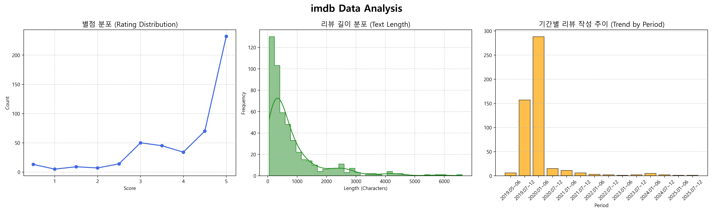
  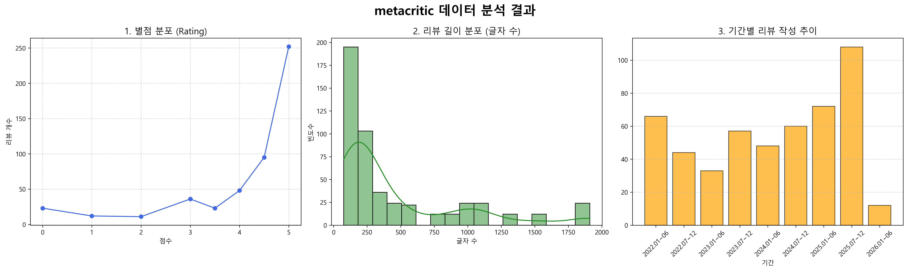
  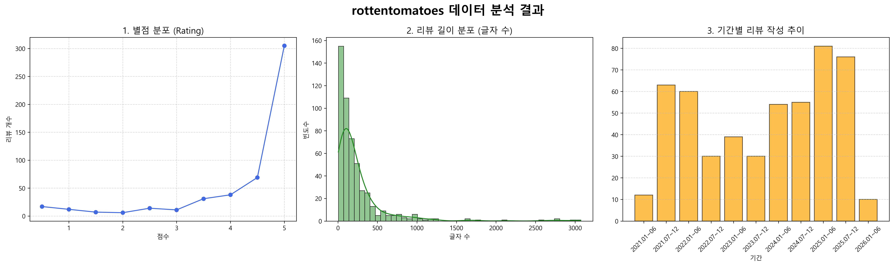
  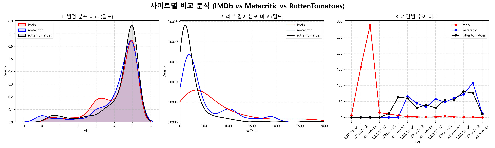
- **해석:**
- - 사이트별 빈번한 키워드
    - IMDB: family, best, story, poor, good, people, rich
    - Metacritic: story, social, best, way, class, poor, family, comedy, masterpiece
    - RottenTomatoes: best, good, story, great, time, family
  - 두 사이트 이상에서 공통적으로 관찰되는 키워드
    - family, best, story, poor, good
  - 분석
    best, good : 영화에 대한 생각(높은 별점과 연관)
    family, poor, story: 영화 스토리에 대한 키워드(가난한 가족들에 관한 스토리)

    세 사이트 모두 전반적으로 영화에 대한 긍정적인 반응이 많았던 것을 확인할 수 있음.
    또한 영화 스토리 또는 장르에 관한 내용들도 자주 언급이 되는 것을 확인할 수 있음.

  - 시계열적으로는, imdb기준으로는 2019년에 많은 리뷰수를, metacritic과 rottentomatoes기준으로는 최근에 비교적 많은 리뷰수를 확인할 수 있었다.
    - 이는 크롤링의 방법에 따른 차이로 보인다.

### 3.3. 전처리 및 Feature Engineering

- **결측치/이상치 처리:**
  항목 중 결측치가 있는 데이터 삭제함.
  텍스트 리뷰 중 분석 용이한 리뷰를 추출하고자 10자 이하 제거함.
  텍스트 리뷰 중 2000자 이상의 리뷰의 경우 2000자를 넘어가는 문장 이전의 문장까지만 추출
- **텍스트 전처리:**
  텍스트 리뷰 중 분석 용이한 리뷰를 추출하고자 10자 이하 2000자 이상 리뷰를 제거함.  
   단어를 벡터화 하기 위하여 동일 단어에 다른 벡터를 부여할 수 있는 이모지를 포함한 특수문자를 제거하고, 문장 부호 앞 공백을 의도적으로 추가함.

- **파생변수**
  파생변수'Extreme_score' 식 : (평점 중간값 기준으로 분산) \* (리뷰 길이)
  선정 이유 : 좋거나 나쁘다고 판단한 관객의 리뷰에서 좋은 이유, 나쁜 근거를 더 명백하게 추출 할 수 있고, 텍스트 데이터의 길이가 길수록 근거가 풍부하거나 자세한 이유를 담았다고 판단아혀 추후 분석할 때 주목할만한 데이터로서의 점수를 데이터를 만들고자 함.
- **벡터화**
  단어들을 이용하여 동시발생 행렬을 만들고, 이를 PPMI 매트릭스로 만든 후 SVD를 이용하여 100개의 차원으로 압축하였음.

### 3.4. 비교 분석 결과

- **사이트별 키워드 비교 (WordCloud):**
  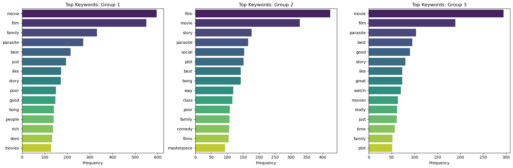
- **파생변수 값 시계열 분석**
  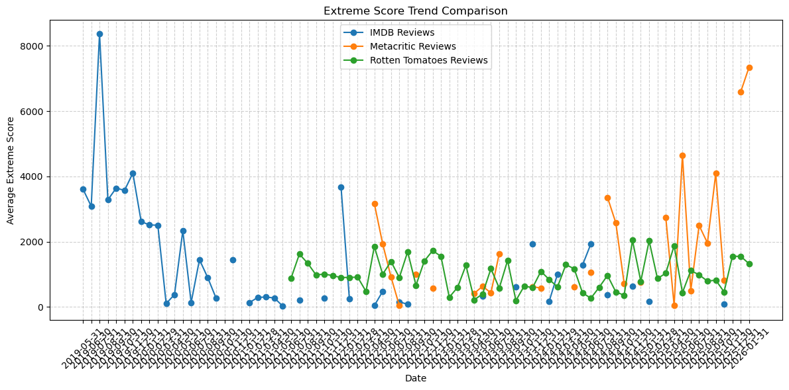
- **결론:**
  - 각 사이트의 점수를 0~5점으로 정규화한 데이터를 분석하였을 때 전반적으로 5점으로 갈수록 상승하는 우상향 형태를 띄고 있음.

  - 리뷰 길이의 경우, RottenTomatoes > Metacritic > IMDb 순으로 길이가 길어지는 모습을 확인할 수 있음.
    전반적으로 500자 이내의 짧은 리뷰들이 대부분이지만, IMDb의 경우 2000자 이상의 긴 리뷰들도 다소 존재함.

  - 시계열 분석 결과, IMDb에서는 약간의 감소 추세를, Metacritic에서는 최근의 증가 추세를 볼 수 있었다.

---

## 4. GitHub 협업 과제 인증

_(이번 과제 요구사항: Branch Protection, Push Reject, PR & Merge 인증 샷 첨부)_

### 4.1. Branch Protection Rule 설정

- **설명:** main 브랜치에 직접 push를 막고, PR을 통해서만 merge 되도록 설정함.
  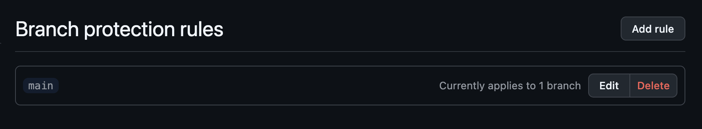

### 4.2. Main 브랜치 Push 거부 (Reject)

- **설명:** 로컬에서 main 브랜치로 직접 push 시도 시 차단되는 화면임.
  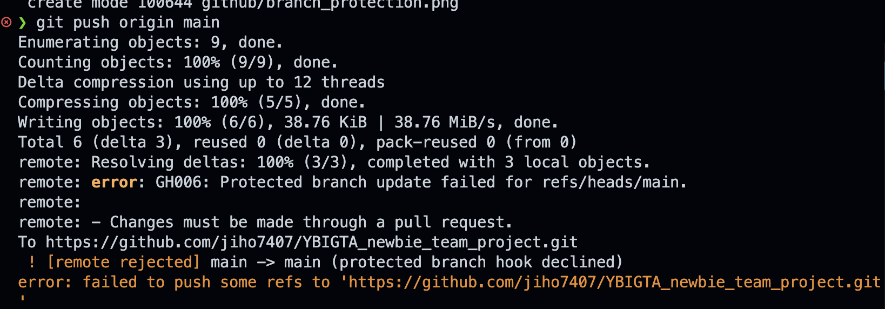

### 4.3. Pull Request 및 Merge 과정

- **설명:** PR 생성 → 팀원 리뷰(Review) → Merge가 완료된 화면임.
  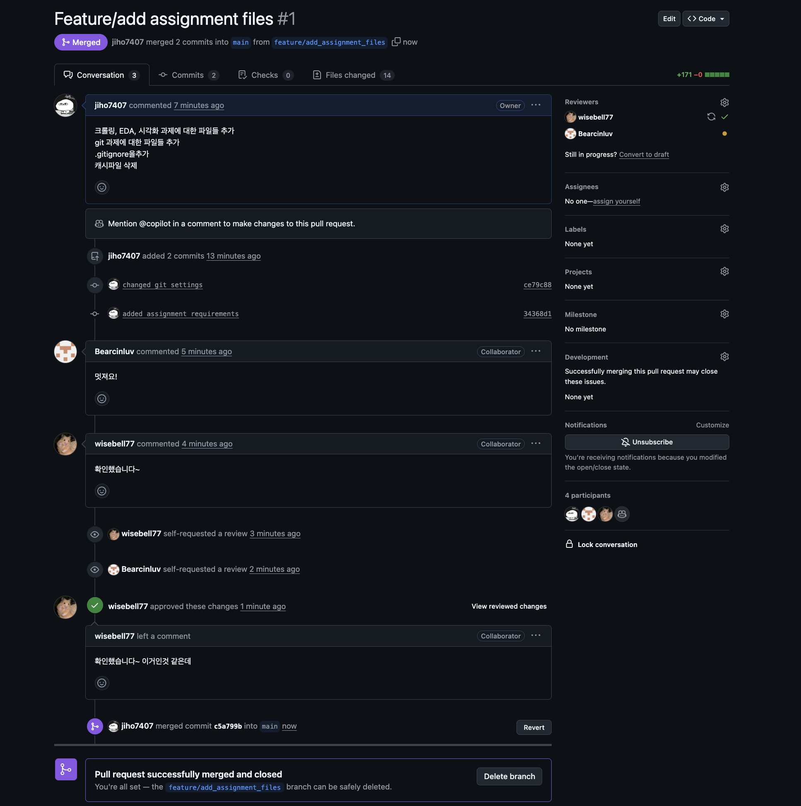

---

## 5. 과제 수행 내역

### 5.1. DB, Docker, AWS, CI/CD

- **DB & API**: MySQL(RDS)와 MongoDB(Atlas)를 사용하여 DB 환경을 구축했습니다. 사용자 정보(User)는 MySQL, 리뷰 데이터(Review)는 MongoDB를 통해 관리하도록 `user_repository.py`와 `dependencies.py`를 수정하고, `review` 관련 API를 신규 구현했습니다.
- **Docker**: `Dockerfile`과 `.dockerignore`를 작성하여 프로젝트를 컨테이너화하고, 생성된 이미지를 Docker Hub에 업로드했습니다.
  - **Docker Hub**: [https://hub.docker.com/r/zyyo/ybigta-project](https://hub.docker.com/r/zyyo/ybigta-project)
- **AWS & CI/CD**: Docker 이미지를 AWS EC2 인스턴스에 배포하고, GitHub Actions를 통해 main 브랜치에 코드가 푸시될 때마다 자동으로 Docker 이미지를 빌드 및 푸시한 후 EC2에 배포하는 CI/CD 파이프라인을 구축했습니다.

### 5.2. API 실행 결과

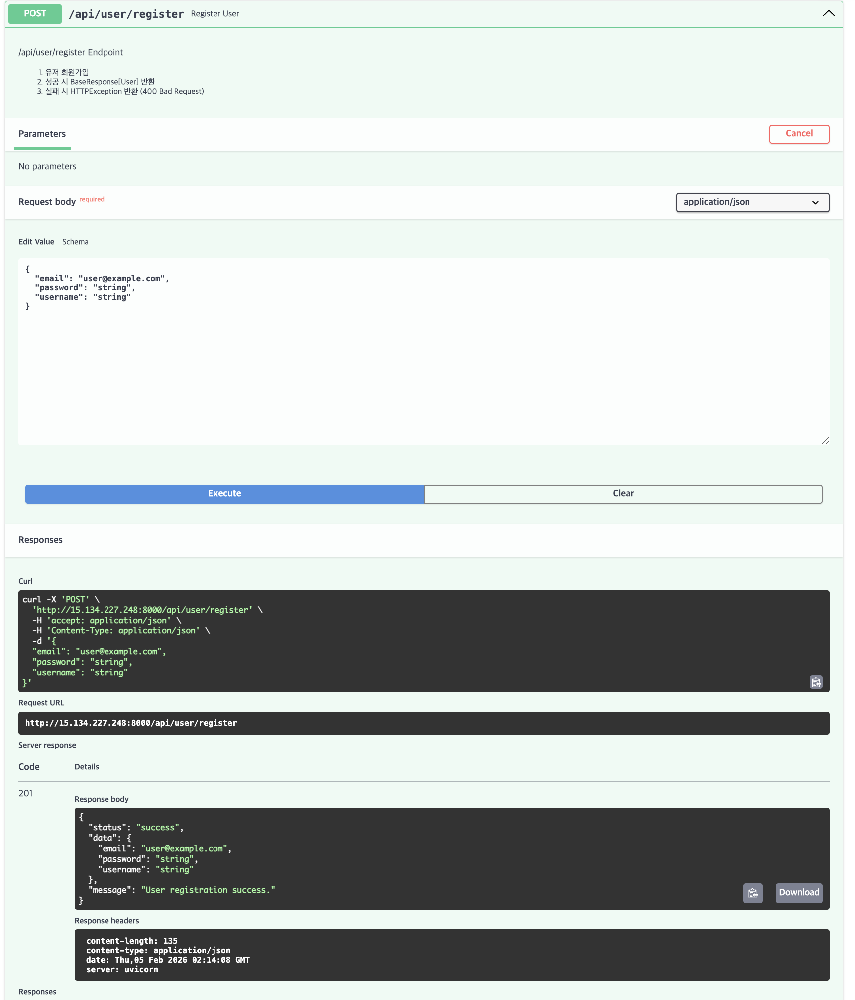
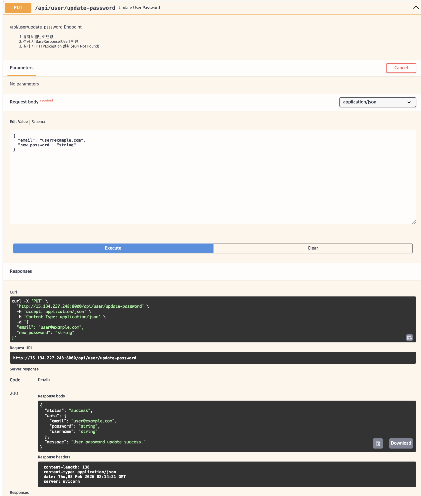
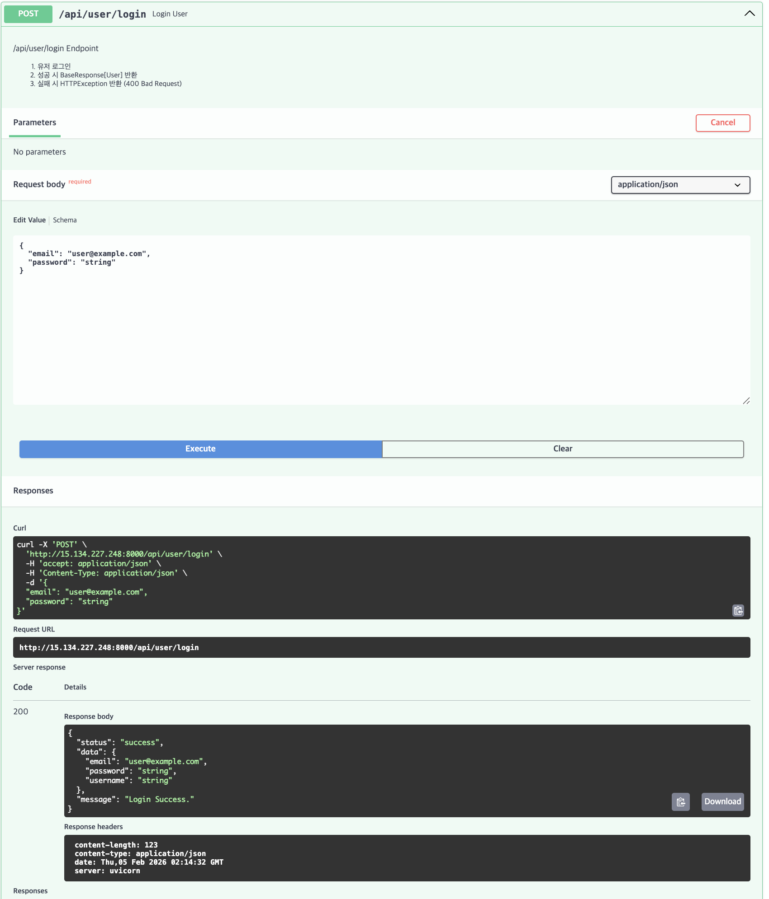
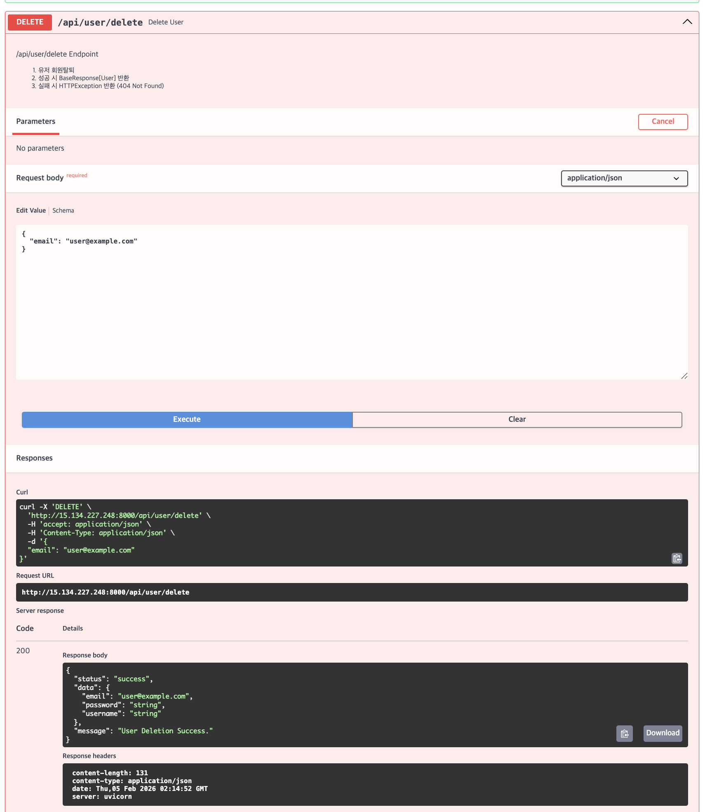
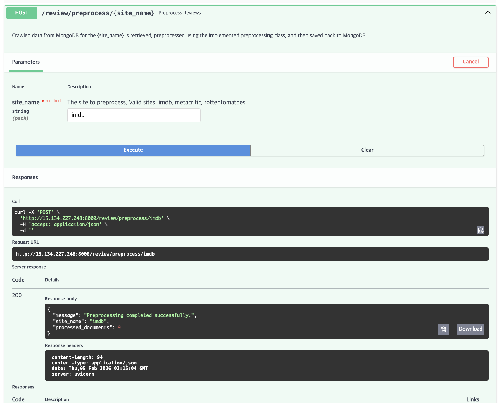


### 5.3. 발생했던 어려움

- Docker Hub 저장소 이름에는 대문자를 사용할 수 없었습니다.
- EC2 인스턴스의 RAM 부족으로 스왑 메모리를 설정해야 했습니다.
- 로컬 환경과 배포 환경 간의 포트 충돌(8080/8000) 이슈가 있었습니다.
- AWS 보안 그룹의 인바운드와 아웃바운드 규칙의 차이를 이해하는 데 시간이 걸렸습니다.
- GitHub Secrets는 생성 후 다시 확인할 수 없어 처음엔 당황했습니다.

---

## 6. RAG/Agent 챗봇 데모 (Streamlit)

### 6.1. 데모 링크

```
https://jiho7407-ybigta-newbie-team-project-streamlit-app-wbg8sk.streamlit.app/
```

### 6.2. 작동 화면
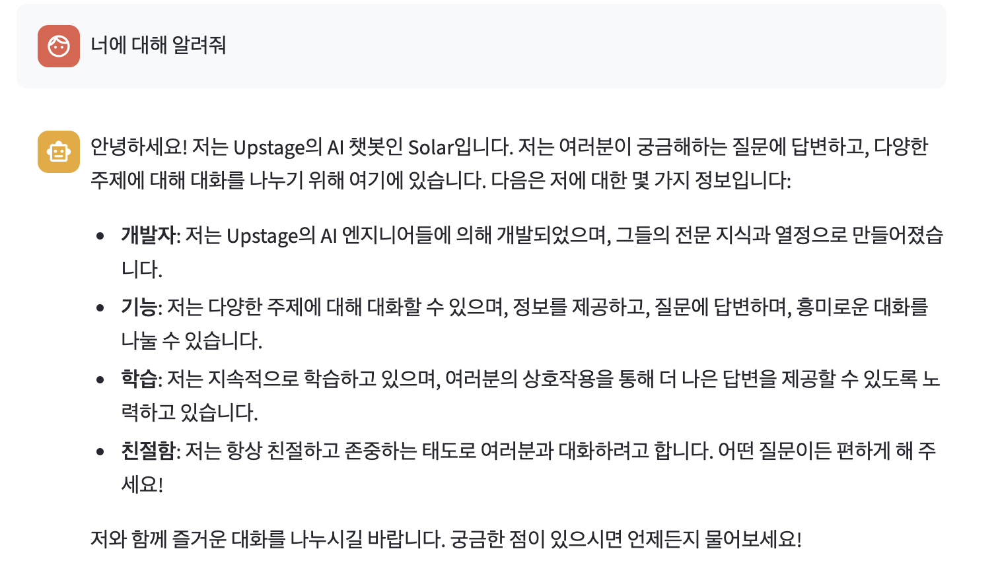
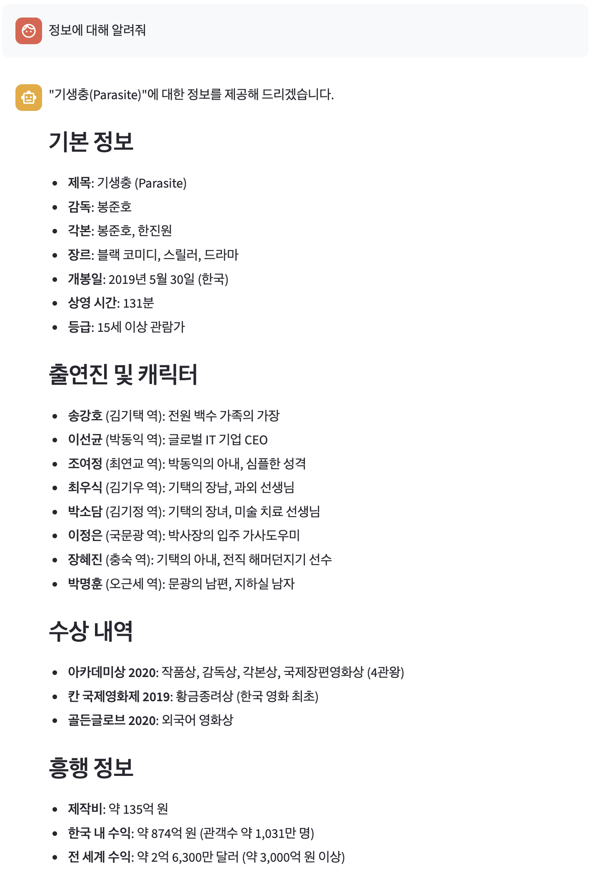
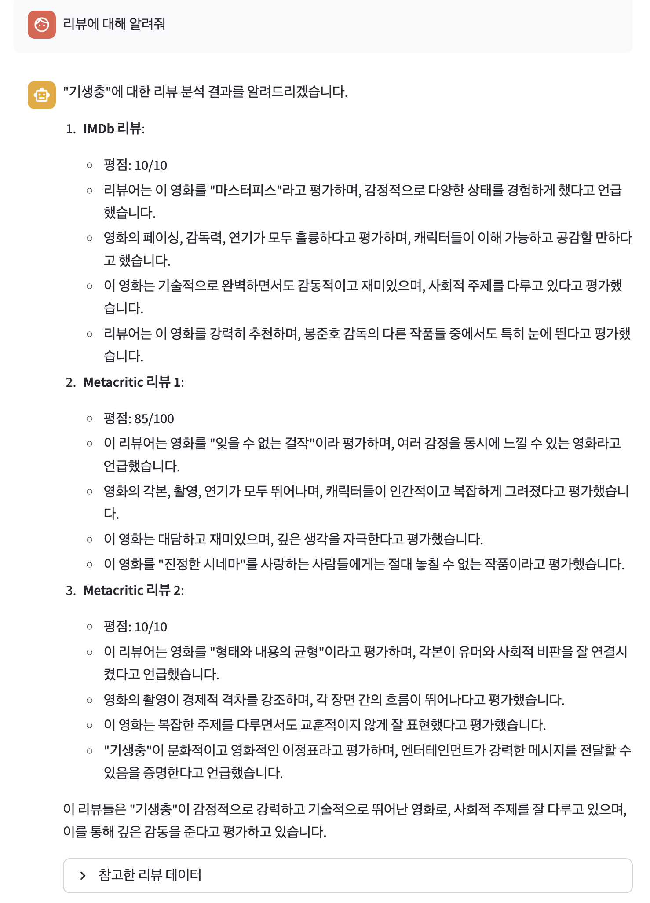

### 6.3. 수정한 명세 CSV
`database/total_reviews.csv`

### 6.4. 실행 방법 및 API 키 설정

- 위 데모 링크에 접속하여 챗봇과 상호작용할 수 있습니다.
